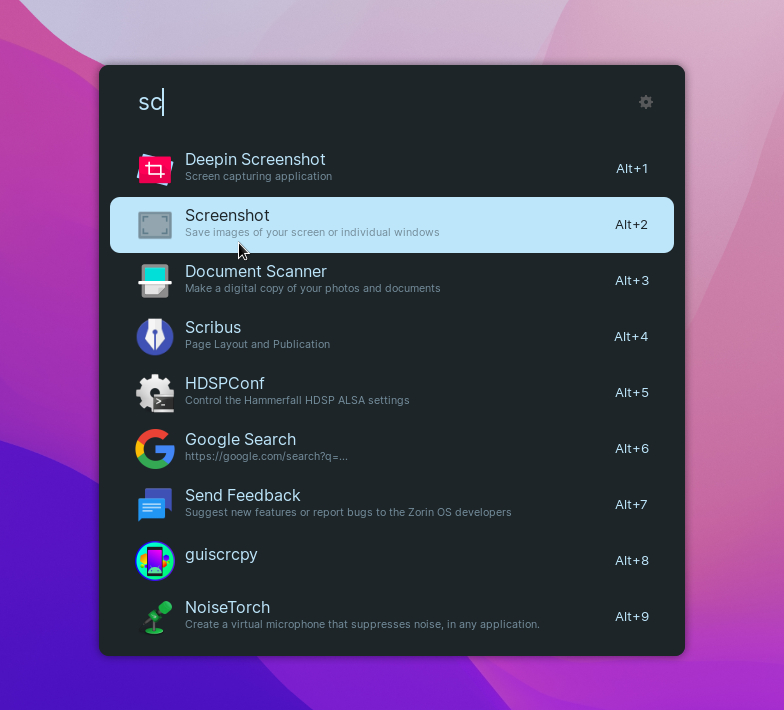

# ulauncher-zorinBlueDark

A ZorinOS Blue Dark theme for Ulauncher

### Installing

To install this theme, just copy paste the command below in your terminal:

```
git clone https://github.com/NayamAmarshe/ulauncher-zorinBlueDark/ \
  ~/.config/ulauncher/user-themes/zorin-blue-dark
```

###### OR

Download the zip file from here: https://github.com/NayamAmarshe/ulauncher-zorinBlueDark/archive/refs/heads/master.zip

and extract the `ulauncher-zorinBlueDark-main` folder to `/home/YourUsername/.config/ulauncher/user-themes/`

### Preview


